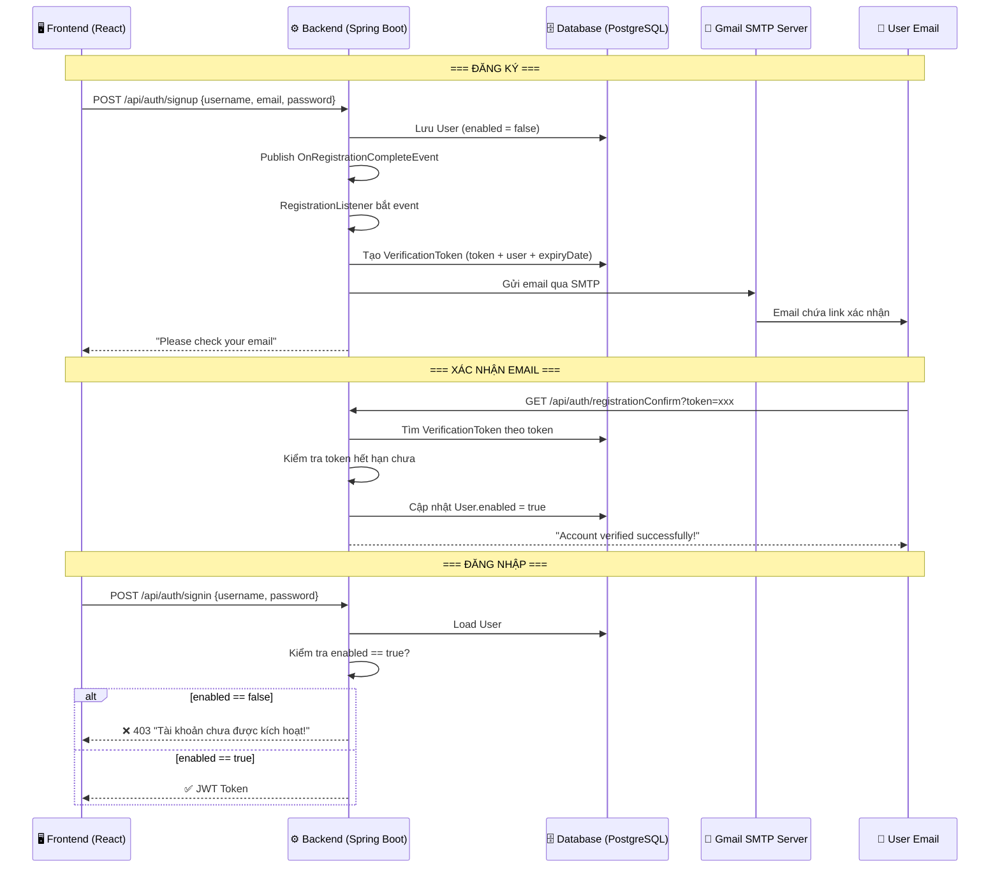

# Walkthrough: Sửa lỗi & Giải thích Email Verification

## Phần 1: Tóm tắt các lỗi đã sửa

### ✅ Đã sửa 10 file, 5 lỗi

| # | Lỗi | File | Thay đổi |
|---|------|------|----------|
| 1 | Sai package `main.java.com...` | 7 file | Sửa thành `com.example.todolist.*` |
| 2 | Frontend thiếu email | [Register.js](file:///d:/ALL_SOURCE_CODE/TodoList_Prj/fe/src/components/Register.js), [auth.service.js](file:///d:/ALL_SOURCE_CODE/TodoList_Prj/fe/src/services/auth.service.js) | Thêm email field + param |
| 3 | `isEnabled()` luôn `true` | [UserDetailsImpl.java](file:///d:/ALL_SOURCE_CODE/TodoList_Prj/be/src/main/java/com/example/todolist/security/UserDetailsImpl.java) | Trả về giá trị thực từ DB |
| 4 | Dead code | [auth.service.js](file:///d:/ALL_SOURCE_CODE/TodoList_Prj/fe/src/services/auth.service.js) | Xóa `console.log` sau `return` |
| 5 | Gmail password | Chưa sửa — cần bạn tự cấu hình | Xem hướng dẫn bên dưới |

### Build Result
```
[INFO] BUILD SUCCESS
```

---

## Phần 2: Hướng dẫn tạo Gmail App Password

> [!IMPORTANT]
> Gmail **không cho phép** ứng dụng bên thứ ba đăng nhập bằng mật khẩu thường. Bạn phải dùng **App Password** (mật khẩu ứng dụng).

### Bước 1: Bật Xác minh 2 bước (2-Step Verification)
1. Vào [Google Account Security](https://myaccount.google.com/security)
2. Kéo xuống phần **"How you sign in to Google"**
3. Click **"2-Step Verification"** → Bật lên
4. Làm theo hướng dẫn (thêm số điện thoại)

### Bước 2: Tạo App Password
1. Sau khi bật 2-Step Verification, vào: [https://myaccount.google.com/apppasswords](https://myaccount.google.com/apppasswords)
2. Tại ô **"App name"**, nhập: `TodoList Spring Boot`
3. Click **"Create"**
4. Google sẽ hiện **mật khẩu 16 ký tự** dạng: `abcd efgh ijkl mnop`
5. Copy mật khẩu đó (bỏ khoảng trắng)

### Bước 3: Cập nhật application.properties
Mở [application.properties](file:///d:/ALL_SOURCE_CODE/TodoList_Prj/be/src/main/resources/application.properties) và sửa:

```diff
-spring.mail.password=dat020705
+spring.mail.password=abcdefghijklmnop
```

Thay `abcdefghijklmnop` bằng App Password bạn vừa tạo.

---

## Phần 3: Giải thích Email Verification từ A → Z

Bạn nói mới học Spring Boot nên tôi sẽ giải thích **từng phần** thật chi tiết.

### 🧩 Bức tranh tổng thể



---

### 📦 Phần A: Cấu hình gửi email — Spring Mail

#### File: [application.properties](file:///d:/ALL_SOURCE_CODE/TodoList_Prj/be/src/main/resources/application.properties)

```properties
spring.mail.host=smtp.gmail.com          # Server SMTP của Gmail
spring.mail.port=587                     # Cổng TLS
spring.mail.username=ledat02072005@gmail.com  # Email gửi đi
spring.mail.password=abcdefghijklmnop    # App Password (KHÔNG phải mật khẩu Gmail!)
spring.mail.properties.mail.smtp.auth=true           # Bật xác thực
spring.mail.properties.mail.smtp.starttls.enable=true # Bật mã hóa TLS
```

#### Giải thích:
- **SMTP** (Simple Mail Transfer Protocol) là giao thức gửi email. Giống như HTTP là giao thức web, SMTP là giao thức email.
- **Gmail SMTP server** (`smtp.gmail.com`) là "bưu điện" của Google. App của bạn gửi thư đến đây, rồi Gmail chuyển tiếp đến người nhận.
- **Port 587** là cổng dùng TLS (bảo mật). Có 2 cổng phổ biến:
  - `587` = STARTTLS (khuyên dùng)
  - `465` = SSL (cũ hơn)
- **App Password** cần thiết vì Google chặn "Less Secure Apps" từ 2022. App Password là mật khẩu riêng biệt chỉ dùng cho ứng dụng bên thứ ba.

#### Trong pom.xml:
```xml
<dependency>
    <groupId>org.springframework.boot</groupId>
    <artifactId>spring-boot-starter-mail</artifactId>
</dependency>
```
Dependency này tự động cấu hình `JavaMailSender` bean dựa trên các property ở trên. Bạn không cần tạo bean thủ công!

---

### 📝 Phần B: Luồng đăng ký — Controller + Event System

#### File: [AuthController.java](file:///d:/ALL_SOURCE_CODE/TodoList_Prj/be/src/main/java/com/example/todolist/controller/AuthController.java) — `/signup`

```java
@PostMapping("/signup")
public ResponseEntity<?> registerUser(@Valid @RequestBody SignupRequest signUpRequest, 
                                       HttpServletRequest request) {
    // 1. Kiểm tra trùng username
    if (userRepository.existsByUsername(signUpRequest.getUsername())) {
        throw new UsernameAlreadyExistsException("Username is already taken!");
    }
    // 2. Kiểm tra trùng email
    if (userRepository.existsByEmail(signUpRequest.getEmail())) {
        throw new EmailAlreadyExistsException("Email is already in use!");
    }
    // 3. Tạo user mới (enabled = false mặc định)
    User user = new User(signUpRequest.getUsername(),
            signUpRequest.getEmail(),
            encoder.encode(signUpRequest.getPassword()));
    userService.save(user);

    // 4. ★ Publish event → Spring sẽ tìm Listener xử lý
    String appUrl = request.getContextPath();
    eventPublisher.publishEvent(new OnRegistrationCompleteEvent(user, appUrl));

    return ResponseEntity.ok(new MessageResponse("Please check your email..."));
}
```

#### Tại sao dùng Event thay vì gọi trực tiếp?

Bạn có thể hỏi: "Sao không gọi thẳng `mailSender.send()` trong controller?"

Lý do dùng **Event Pattern**:
1. **Tách biệt trách nhiệm** (Separation of Concerns): Controller chỉ lo đăng ký, không cần biết cách gửi email
2. **Dễ mở rộng**: Sau này bạn muốn thêm "gửi SMS", "log audit" — chỉ cần thêm Listener mới, không sửa controller
3. **Có thể chạy async**: Thêm `@Async` vào Listener để gửi email không blocking request

#### Cách Event hoạt động:

```
Controller                    Spring Framework              Listener
    │                              │                           │
    │── publishEvent(event) ──────>│                           │
    │                              │── onApplicationEvent() ──>│
    │                              │                           │── Gửi email
    │<── return response ──────────│                           │
```

---

### 📧 Phần C: Gửi Email — Event Listener

#### File: [RegistrationListener.java](file:///d:/ALL_SOURCE_CODE/TodoList_Prj/be/src/main/java/com/example/todolist/event/listener/RegistrationListener.java)

```java
@Component  // ← Spring tự động quản lý bean này
public class RegistrationListener 
    implements ApplicationListener<OnRegistrationCompleteEvent> {
    //                             ↑ Chỉ lắng nghe event loại này

    @Autowired
    private IUserService service;    // Để tạo verification token

    @Autowired
    private JavaMailSender mailSender;  // Spring tự inject nhờ spring-boot-starter-mail

    @Override
    public void onApplicationEvent(OnRegistrationCompleteEvent event) {
        // Khi event được publish, method này tự động chạy
        User user = event.getUser();
        
        // 1. Tạo token ngẫu nhiên (UUID)
        String token = UUID.randomUUID().toString();
        // VD: "550e8400-e29b-41d4-a716-446655440000"
        
        // 2. Lưu token vào DB (gắn với user + ngày hết hạn)
        service.createVerificationToken(user, token);
        
        // 3. Tạo link xác nhận
        String confirmationUrl = event.getAppUrl() 
            + "/api/auth/registrationConfirm?token=" + token;
        
        // 4. Gửi email
        SimpleMailMessage email = new SimpleMailMessage();
        email.setTo(user.getEmail());           // Gửi đến email user
        email.setSubject("Registration Confirmation");
        email.setText("Click link: " + confirmationUrl);
        mailSender.send(email);  // ← Gửi qua Gmail SMTP
    }
}
```

#### `SimpleMailMessage` vs `MimeMessage`:
- **SimpleMailMessage**: Email text thuần, không HTML, không attachment. Đơn giản nhưng đủ dùng.
- **MimeMessage**: Email HTML (có màu sắc, nút bấm), có thể đính kèm file. Phức tạp hơn.

---

### 🔑 Phần D: Xác nhận Token — Endpoint `/registrationConfirm`

#### File: [AuthController.java](file:///d:/ALL_SOURCE_CODE/TodoList_Prj/be/src/main/java/com/example/todolist/controller/AuthController.java)

```java
@GetMapping("/registrationConfirm")
public ResponseEntity<?> confirmRegistration(
    WebRequest request, 
    @RequestParam("token") String token) {  // Lấy token từ URL parameter
    
    String result = userService.validateVerificationToken(token);
    if (result == null) {  // null = thành công
        return ResponseEntity.ok(new MessageResponse("Account verified!"));
    }
    return ResponseEntity.badRequest().body(new MessageResponse(result));
}
```

#### File: [UserService.java](file:///d:/ALL_SOURCE_CODE/TodoList_Prj/be/src/main/java/com/example/todolist/service/UserService.java)

```java
public String validateVerificationToken(String token) {
    // 1. Tìm token trong DB
    VerificationToken verificationToken = tokenRepository.findByToken(token);
    if (verificationToken == null) {
        return "invalidToken";  // Token không tồn tại
    }
    
    // 2. Kiểm tra hết hạn
    User user = verificationToken.getUser();
    Calendar cal = Calendar.getInstance();
    if (verificationToken.getExpiryDate().getTime() - cal.getTime().getTime() <= 0) {
        tokenRepository.delete(verificationToken);
        return "expired";  // Token đã hết hạn (24 giờ)
    }
    
    // 3. ★ Kích hoạt tài khoản!
    user.setEnabled(true);  // Từ false → true
    userRepository.save(user);
    return null;  // null = thành công
}
```

---

### 🔒 Phần E: Chặn login user chưa verify — UserDetailsImpl

#### File: [UserDetailsImpl.java](file:///d:/ALL_SOURCE_CODE/TodoList_Prj/be/src/main/java/com/example/todolist/security/UserDetailsImpl.java)

```java
// TRƯỚC (lỗi): Luôn trả true → ai cũng login được
@Override
public boolean isEnabled() {
    return true;
}

// SAU (đã sửa): Trả về giá trị thực từ DB
@Override
public boolean isEnabled() {
    return enabled; // false nếu chưa verify email
}
```

#### Tại sao Spring Security dùng `isEnabled()`?

Khi bạn gọi `authenticationManager.authenticate(...)`, Spring Security thực hiện:

1. ✅ Tìm user trong DB qua `loadUserByUsername()`
2. ✅ So khớp password (BCrypt)
3. ✅ Kiểm tra `isAccountNonExpired()` — tài khoản chưa hết hạn?
4. ✅ Kiểm tra `isAccountNonLocked()` — tài khoản chưa bị khóa?
5. ✅ Kiểm tra `isCredentialsNonExpired()` — mật khẩu chưa hết hạn?
6. ★ Kiểm tra `isEnabled()` — **tài khoản đã kích hoạt?**

Nếu bất kỳ bước nào trả `false`, Spring ném exception:
- `isEnabled() = false` → ném `DisabledException` → bị bắt bởi `GlobalExceptionHandler` → trả về *"Tài khoản chưa được kích hoạt!"*

---

### 🗃️ Phần F: VerificationToken Entity

#### File: [VerificationToken.java](file:///d:/ALL_SOURCE_CODE/TodoList_Prj/be/src/main/java/com/example/todolist/model/VerificationToken.java)

```java
@Entity
public class VerificationToken {
    private static final int EXPIRATION = 60 * 24;  // 24 giờ (đơn vị: phút)

    @Id @GeneratedValue
    private Long id;

    private String token;  // UUID ngẫu nhiên

    @OneToOne(fetch = FetchType.EAGER)
    @JoinColumn(name = "user_id")
    private User user;     // Gắn với user nào

    private Date expiryDate;  // Ngày hết hạn

    public VerificationToken(String token, User user) {
        this.token = token;
        this.user = user;
        this.expiryDate = calculateExpiryDate(EXPIRATION); // Tự tính = now + 24h
    }
}
```

**Bảng trong DB**:
| id | token | user_id | expiry_date |
|----|-------|---------|-------------|
| 1 | 550e8400-e29b-... | 5 | 2026-05-28 16:00:00 |

---

## ⚠️ Việc cần làm tiếp

> [!WARNING]
> Bạn cần tự tạo **Gmail App Password** theo hướng dẫn ở Phần 2 và cập nhật vào [application.properties](file:///d:/ALL_SOURCE_CODE/TodoList_Prj/be/src/main/resources/application.properties). Nếu không, ứng dụng sẽ crash khi cố gửi email do xác thực Gmail thất bại.
